<div align="center">



<br>

[](https://git.io/typing-svg)

</div>

```text
┌──(operator㉿github)-[~/profile]
└─$ cat mission.txt

Penetration Tester.
I enjoy finding the attack path others overlook,
turning complex systems into solvable puzzles,
and building labs that teach others how attackers think.
```

## `01 // OPERATOR PROFILE`

```yaml
handle: ICHYABOY
role:
  - Penetration Tester
  - Security Researcher
  - Cybersecurity Compliance Tester
focus:
  - Web & API Security
  - Active Directory
  - Network & Linux Exploitation
  - Medical Devices, BLE and Embedded Systems
  - EN 18031 Functional Security Testing
certifications:
  - CPTS
  - CRTP
  - CRTE
status: "Always learning. Usually breaking something legally."
```

## `02 // CAPABILITY MATRIX`

| Surface | Capabilities |
|---|---|
| **Web / API** | Authentication, authorization, business logic, SSRF, deserialization, file handling, injection |
| **Active Directory** | Enumeration, attack-path analysis, Kerberos abuse, delegation, lateral movement |
| **Infrastructure** | Linux, Windows, network services, tunneling, privilege escalation |
| **Devices** | BLE traffic analysis, firmware review, embedded interfaces, kiosk escape testing |
| **Compliance** | EN 18031 evidence-oriented functional security testing |
| **Reporting** | Reproducible findings, risk analysis, remediation guidance, technical wiki building |

## `03 // TOOLCHAIN`

<div align="center">


</div>

## `04 // SELECTED OPERATIONS`

> Replace these examples with your best public repositories. Do not publish customer information, private targets, flags, credentials, or proprietary exploit details.

<table>
<tr>
<td width="50%">

### 🛰️ `attack-surface-lab`
A deliberately vulnerable environment demonstrating realistic enumeration and attack-path discovery.

**Signals:** `Python` `Docker` `Web` `AD`

</td>
<td width="50%">

### 🧬 `ble-security-notes`
Practical BLE testing notes: pairing, captures, GATT enumeration, protocol observations, and defensive lessons.

**Signals:** `BLE` `Wireshark` `nRF`

</td>
</tr>
<tr>
<td width="50%">

### 🩺 `device-security-wiki`
Customer-safe technical testing methodology for connected and medical devices.

**Signals:** `Embedded` `EN 18031` `Reporting`

</td>
<td width="50%">

### 🧰 `operator-toolkit`
Small utilities for enumeration, parsing, evidence collection, and reporting automation.

**Signals:** `Python` `Bash` `Automation`

</td>
</tr>
</table>

## `05 // TELEMETRY`

<div align="center">

<!-- Replace YOUR_USERNAME in both URLs. -->


</div>


## `06 // OPEN CHANNELS`

<div align="center">

[](https://ichyaboys-village.gitbook.io/ichyaboys-village)
[](https://www.linkedin.com/in/ahmed-elkefi/)
[](mailto:YOUR_EMAIL)

</div>

```text
[LEGAL NOTICE]
All security work shown here is performed in authorized labs,
CTFs, owned systems, or explicitly permitted professional engagements.
```

<div align="center">
  <sub>END OF TRANSMISSION // BUILD • BREAK • REPORT • IMPROVE</sub>
</div>
